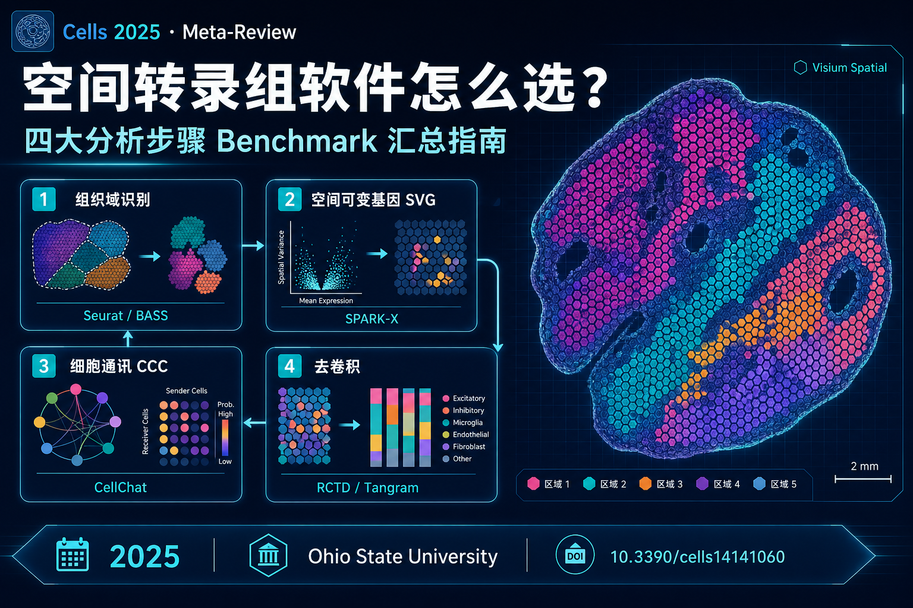

# 空间转录组软件怎么选？2025 年这篇 Meta-Review 把四大分析步骤的 Benchmark 结果都汇总了



> **论文** | Gillespie J, Pietrzak M, Song M-A, Chung D. *Cells*, 2025, 14(14): 1060  
> **题目** | A Meta-Review of Spatial Transcriptomics Analysis Software  
> **DOI** | [10.3390/cells14141060](https://doi.org/10.3390/cells14141060)  
> **机构** | 俄亥俄州立大学（Ohio State University）生物医学信息学系 / 综合癌症中心

---

## 一句话总结

空间转录组（ST）分析工具已经「多到选不过来」，但各软件论文里的数据集、硬件和评价指标各不相同，很难直接比。

这篇 **Meta-Review** 不做新的 Benchmark，而是把已有 Benchmark 文献里的结果**二次整合**，按 ST 分析中最常做的 **四大步骤**——组织域识别、空间可变基因（SVG）、细胞通讯、去卷积——给出**跨研究一致表现较好**的软件推荐，并强调：**没有万能工具，选型必须结合数据类型、平台和算力**。

---

## 为什么需要这篇综述？

Bulk RNA-seq 看的是样本平均表达，scRNA-seq 能到单细胞但丢失空间位置。ST 把**基因表达 + 空间坐标**合在一起，适合研究：

- 肿瘤异质性与免疫浸润的空间格局  
- 发育过程中的区域化表达  
- 组织图谱构建  
- 配体-受体介导的细胞邻域通讯  

问题是：每个软件单独发 paper 时，用的数据集、评价指标、硬件环境都不一样。只有在**统一条件下的 head-to-head Benchmark**，才更有参考价值。

本文整合的选型维度（优先级不完全相同）包括：

| 维度 | 说明 |
|------|------|
| **准确性** | 与 ground truth 或模拟数据对比 |
| **运行时间** | 大数据集是否可扩展 |
| **算力需求** | CPU / 内存 / GPU |
| **编程语言** | R / Python 生态兼容 |
| **Visium 兼容性** | 10x Visium 是目前最常用平台之一 |

---

## 第一步：组织域识别（Tissue Architecture Identification）

**做什么**：结合表达谱和空间坐标，把 spot/细胞聚成空间域，为注释细胞类型、划分功能区打基础。

**整合了哪些 Benchmark**：Cheng et al.、Hu et al.、Yuan et al. 三项研究，共比较 15–23 款软件，覆盖 Visium、MERFISH、Slide-seq、Stereo-seq 等多种平台。

### 综合推荐（尤其面向 Visium 用户）

| 软件 | 优势 | 需要注意 |
|------|------|----------|
| **BASS** | 三项 Benchmark 均常居 accuracy Top 5 | 大数据集扩展性差，算力消耗高 |
| **BayesSpace** | 准确性稳定 | 同样扩展性差；**用 imaging 数据时表现不佳** |
| **SpaGCN** | 速度快、资源占用低 | 空间模式不明显时较弱 |
| **Seurat** | 准确性与速度均衡；**不依赖 H&E** | 生态成熟，Visium 工作流友好 |
| **STAGATE** | 准确性略逊但 workflow 友好 | 当前几项推荐都搞不定时可选 |

### 三个 Benchmark 共同揭示的规律

1. **预处理影响巨大**，后处理（如空间平滑）通常普遍提升聚类质量。  
2. **是否使用 H&E 并不决定成败**：Seurat 等不用组织学图像的方法并不吃亏；更好的 H&E **不等于**更好的聚类。  
3. **预设 cluster 数**若与真实细胞类型数不符，会显著拉低 accuracy。  
4. **高度依赖数据集**：同一软件在脑组织表现好、换组织可能变差；样本来源与测序平台都是关键因素。  
5. **算法类型没有绝对赢家**：Bayesian（BASS/BayesSpace）、图方法（SpaGCN/Seurat）、深度学习（STAGATE）都能进第一梯队。  
6. **随机种子**会影响部分方法的结果稳定性。

> **实操建议**：Visium 项目若追求稳妥，可优先 **Seurat** 或 **SpaGCN**；若算力充足、追求极致分群精度，再试 **BASS / BayesSpace**，并务必做 cluster 数敏感性分析。

---

## 第二步：空间可变基因（SVG）识别

**做什么**：找出表达随空间位置显著变化的基因，揭示组织学上看不出的「功能区域」。

**Benchmark 来源**：Li et al.（模拟数据 + auPRC）、Chen et al.（21 个真实数据集 + 软件间 SVG 列表相关性）。

### 综合推荐

| 软件 | 特点 |
|------|------|
| **SpatialDE2** | 准确性常居榜首；但对 downsampling / 超多 spot 敏感，**慢且吃内存** |
| **SPARK-X** | 准确性稳定 Top 3，**显著更快、更省内存** → 综合性价比最高 |
| **SOMDE** | 快、轻量、FDR 控制好；**灵敏度偏低** |
| **Moran's I（Squidpy）** | 基于置换检验，稀疏 spot 表现好；**FDR 偏高** |

### 关键发现

- **噪声**越大，所有方法性能都下降。  
- 不同软件返回的 SVG **列表重叠度很低**——统计框架相似，但结果并不一致。  
- SVG 排名与**基因表达量**正相关，存在系统性偏差。  
- 多数工具**高灵敏度 OR 高特异度**，很难两者兼得。  
- 图方法与核方法整体表现相当。

> **实操建议**：日常分析优先 **SPARK-X**；需要更保守、更精细的统计推断时再上 **SpatialDE2**；探索性分析可用 **Moran's I** 作补充。

---

## 第三步：细胞-细胞通讯（Cell-Cell Communication）

**做什么**：基于配体-受体（L-R）数据库和空间邻近关系，推断哪些细胞群可能在「对话」。

**Benchmark 来源**：Liu et al.，16 款软件，用 **距离富集分数（DES）** 衡量模拟 vs 真实数据中 L-R 空间距离模式的一致性。

### 综合推荐

| 软件 | 特点 |
|------|------|
| **CellChat** | 综合表现最佳；整合调控信息；**快、省资源**；空间数据一致性好 |
| **CellPhoneDB** | 与 CellChat、ICELLNET 同属第一梯队 |
| **ICELLNET** | 同上，轻量快速 |
| **NicheNet** | 常居第二；网络推断思路独特；稀疏数据友好但 **FDR 偏高** |
| **SingleCellSignalR** | 准确性尚可，但**算力开销大、精度一般** |

### 关键发现

- 准确性**强依赖数据集**。  
- 各软件内置的 **L-R 数据库不同**，仅换数据库就会改变结果。  
- 预测互作越多 → **召回率高**；预测越少 → **精确率高**。  
- **目前无法用实验金标准直接验证** L-R 表达是否等于真实通讯，这是领域共性局限。

> **实操建议**：Visium + 聚类注释完成后，**CellChat** 或 **CellPhoneDB** 是较稳妥的起点；需要配体下游靶基因推断时可补充 **NicheNet**。

---

## 第四步：去卷积（Deconvolution）

**做什么**：对 Visium 等 spot 级数据，估计每个 spot 里各细胞类型的比例（通常需要配对 scRNA-seq 参考）。

**Benchmark 来源**：Li et al.、Yan & Sun、Li et al.（整合方法）等多项研究。

### 综合推荐

| 软件 | 特点 |
|------|------|
| **Cell2location** | **准确性最高**；Probabilistic / DL 路线；**极慢、极吃内存** |
| **Tangram** | 准确性接近 Cell2location；**更快更轻**；转录本空间映射表现好 |
| **RCTD** | 多项 Benchmark 稳定 Top 5，**均衡之选** |
| **CARD** | Li et al. Benchmark 中 PCC 表现也不错 |

### 关键发现

1. **强烈建议使用 scRNA-seq 参考**；不依赖 scRNA 的 Berglund 等方法效果明显落后。  
2. 最优方法偏向 **概率模型 + 深度学习**（NMF、图方法、最优传输等相对弱势）。  
3. **标准化方式**对结果影响大：多数 Benchmark 倾向 **原始 count** 优于某些 lognorm / scTransform 方案（也因样本而异）。  
4. **spot 越小、数据越稀疏**，整合类方法越吃力。  
5. scRNA 与 ST 若细胞群组成假设不一致，会引入系统误差。  
6. **EnDecon** 等多方法集成只带来**边际提升**。

> **实操建议**：常规 Visium 项目 → **RCTD** 或 **Tangram**；有 GPU 集群、追求上限 → **Cell2location**。

---

## 一张「Visium 探索性分析」快速选型表

基于原文 Figure 2 决策树思路，整理为更易落地的版本：

```
你的 ST 数据（以 10x Visium 为例）
│
├─ 组织域识别 / 聚类
│   ├─ 算力有限、要速度        → Seurat / SpaGCN
│   └─ 算力充足、要精度        → BASS / BayesSpace
│
├─ 空间可变基因 SVG
│   ├─ 常规首选                → SPARK-X
│   └─ 精细统计 / 可接受慢     → SpatialDE2
│
├─ 细胞通讯 CCC
│   ├─ 常规首选                → CellChat / CellPhoneDB
│   └─ 需配体→靶基因网络       → NicheNet（补充）
│
└─ 细胞类型去卷积
    ├─ 均衡实用                  → RCTD / Tangram
    └─ 精度优先 + 大算力         → Cell2location
```

---

## 领域仍未解决的共性问题

原文 Conclusions 部分值得所有 ST 从业者记住：

1. **「没有普适最优解」**：性能高度依赖组织类型、平台、样本来源，可能存在算法对小样本 Benchmark 的**过拟合**。  
2. **参考数据不足**：许多组织缺乏带细胞类型注释、与待分析样本匹配的 scRNA/ST 参考；Aquila、STOmics DB、SOAR 等库仍在完善中。  
3. **Pipeline 级验证缺失**：单步 Benchmark 不等于整条流程最优——上游聚类参数会影响下游 SVG、通讯和去卷积。  
4. **领域迭代极快**：新工具几乎每月都在出现，本文本质是**时间点快照**。  
5. **SVG 与 CCC 的结果列表**在不同软件间一致性仍较差，需要生物学验证（ISH、蛋白、功能实验）支撑。

---

## 给不同用户的阅读建议

| 人群 | 怎么用这篇文章 |
|------|----------------|
| **实验生物学家** | 直接看「快速选型表」，与测序平台、是否有配对 scRNA 对齐 |
| **生信分析人员** | 对照四大步骤检查现有 pipeline 是否为「该步骤的 Benchmark 常胜将军」 |
| **平台 / 方法开发者** | 关注 dataset dependency、FDR/sensitivity 权衡等尚未被很好解决的问题 |
| **肿瘤 ST 项目** | 聚类 + SVG + 去卷积 + CellChat 是常见组合；注意 Visium spot 分辨率限制 |

---

## 推荐 Pipeline 示例（Visium + 配对 scRNA）

```
Space Ranger 原始输出
    ↓
QC & 标准化（注意：去卷积步骤尽量保留 raw count 选项）
    ↓
组织域识别：Seurat（或 BASS / BayesSpace）
    ↓
SVG：SPARK-X
    ↓
去卷积：RCTD / Tangram（参考 scRNA-seq）
    ↓
细胞通讯：CellChat
    ↓
生物学验证 & 功能富集
```

---

## 总结

这篇 Meta-Review 的价值，不在于再发明一个新算法，而在于把分散在多篇 Benchmark 里的结论**拉到一个页面上**：

- **聚类**：BASS / BayesSpace / SpaGCN / Seurat / STAGATE  
- **SVG**：SPARK-X（首选）/ SpatialDE2（精细）  
- **通讯**：CellChat / CellPhoneDB / ICELLNET  
- **去卷积**：Cell2location / Tangram / RCTD  

但作者反复强调：**Benchmark 排名 ≠ 你的样本的最优解**。真正决定结果质量的，往往是——

> 数据预处理是否得当、参考数据是否匹配、cluster 数是否合理、标准化方式是否与算法假设一致，以及有没有足够的生物学验证。

---

## 参考文献

```
Gillespie J, Pietrzak M, Song M-A, Chung D.
A Meta-Review of Spatial Transcriptomics Analysis Software.
Cells. 2025;14(14):1060.
doi: 10.3390/cells14141060
```

**原文链接**：https://doi.org/10.3390/cells14141060

---

*解读基于原文及文中引用的 Benchmark 文献整理，仅供科研交流，分析流程请结合具体项目验证。*
