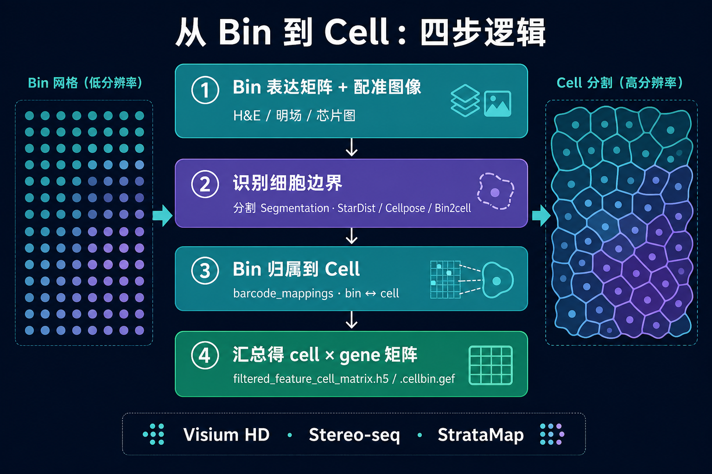

# Bin 级空间转录组，怎么把网格「拆」成单细胞？

> 微信稿 | 主题：测序法 Bin ST 的细胞分割（Cell Segmentation）  
> 适用平台：Visium HD、Stereo-seq、Illumina StrataMap 等
---

## 开篇

做 Visium HD 或 Stereo-seq，Space Ranger / SAW 下机后，你拿到的是一张**规则网格上的表达矩阵**——每个 bin 是一个小方块，**并不等于一个真实细胞**。

很多同学习惯经典 Visium 的套路：spot 混合了多个细胞，用 SPOTlight 去卷积就行。但 Bin 平台的逻辑不一样：**分辨率已经够细，可以走细胞分割**——把连续网格上的 RNA，按细胞边界重新打包。

一个常见误区是：以为 Bin ST 的**所有下游分析**都必须先做分割。其实不是。**组织域、空间可变基因**等很多问题，直接在 bin 上就能做；只有当你要**单细胞注释、细胞通讯、与 scRNA 整合**时，才通常需要 cell 级矩阵。

---

## 一、先搞清：Bin 和 Cell 差在哪？

| | **Bin（数字网格）** | **Cell（生物学单元）** |
|---|---|---|
| 是什么 | 算法划分的固定方块（如 8×8 μm） | 组织里真实的单个细胞 |
| 谁定义的 | 生信流程（Space Ranger / SAW） | 图像 + 分子分布 |
| 典型问题 | 跨细胞、多细胞混合、只盖住细胞一角 | 一细胞一表达谱 |
| 经典 Visium 类比 | — | 更接近 Xenium 的单细胞输出 |

**Spot 平台的核心任务是去卷积；Bin 平台的核心任务是细胞分割。**

Bin 本身可以「假装单细胞」——例如 Stereo-seq 的 Bin20（约 10 μm）接近一个淋巴细胞直径——但那只是**近似**。要做严谨的单细胞分析、细胞通讯或与 scRNA-seq 直接整合，仍需要显式分割。

---

## 二、哪些平台走这条路？

测序法里，**连续捕获面 + Bin 分析**是共同特征：

| 平台 | 硬件特征 | 常用 bin 档位 | 分割输出示例 |
|------|----------|---------------|--------------|
| **10x Visium HD** | 2 μm 连续特征，分析常用 8/16 μm | `square_008um` / `002um` | `segmented_outputs/`、`barcode_mappings.parquet` |
| **Stereo-seq** | 0.5 μm DNB 网格，bin 可调 | bin20 / bin50 / bin100 | `.cellbin.gef` |
| **Illumina StrataMap** | 1 μm 连续特征 | ~10 μm bin | DRAGEN / ICM 细胞级矩阵 |

与之对比，**Xenium、CosMx** 等成像法出厂即单细胞，**不需要** bin→cell 这一步——本文聚焦**测序 + Bin** 路线。

---

## 三、从 Bin 到 Cell：四步逻辑

不管用哪家工具，底层逻辑都一样：

Visium HD 官方输出里，这三步的产物一一对应：

- **分割轮廓**：`cell_segmentations.geojson`
- **归属映射**：`barcode_mappings.parquet`（bin ↔ cell ↔ nucleus）
- **细胞矩阵**：`filtered_feature_cell_matrix.h5`

Stereo-seq 则常见 **`.tissue.gef`（bin 级）→ SAW 分割 → `.cellbin.gef`（cell 级）**。

---

## 四、细胞边界从哪来？三类信息源

### ① 形态学图像（最主流）

- **H&E / 明场**：看细胞形态、胞质范围
- **DAPI / 核染色**：以核为锚点，再膨胀或 watershed 得到细胞范围
- 依赖前提：**图像与 capture 区域配准准确**（CytAssist FFPE 通常要组织图 + 芯片图两张）

常用深度学习工具：**StarDist**（圆核密集组织友好）、**Cellpose**（形态多样、可 fine-tune）。Space Ranger 的分割模块也集成了 StarDist 路线。

### ② 转录本空间分布（图像不佳时的补充）

- 利用 **2 μm 超细 bin** 或分子坐标，看 RNA 在核周的聚集
- 代表工具：**Bin2cell**（Visium HD 社区常用）、**Baysor**、**SCS**（Transformer，适合超高密度 grid）
- 思路：高密度转录本区域 ≈ 细胞位置 → 再聚类/分割

### ③ 平台内置算法（省心首选）

| 平台 | 推荐流程 |
|------|----------|
| Visium HD | Space Ranger `segmented_outputs/`，或 2 μm bin + **Bin2cell** |
| Stereo-seq | SAW → **CellBin**（利用芯片 track line 做亚像素配准） |
| StrataMap | DRAGEN + ICM（宣称整合 1 μm 特征与分割） |

**没有 universal best**——选型取决于平台、染色质量和组织类型。

---

## 五、Visium HD：最常用的实操路径

很多项目会走「**双轨**」：

**为什么 8 μm 和 2 μm 分开用？**

- **8 μm**：适合 SpaGCN、GraphST、空间可变基因——算得快，噪声低
- **2 μm**：是分割的「原材料」——每个 bin 更接近亚细胞定位，但矩阵可达百万列级，内存和存储压力巨大

下游接入 Scanpy / Seurat 后，cell 级对象仍保留 `obsm['spatial']`（多为细胞质心），并可回溯原始 bin count 做 QC。

---

## 六、Stereo-seq 与 StrataMap 要点

### Stereo-seq

- Bin 档位灵活：Bin20（~10 μm）≈ 单细胞尺度；Bin50/100 更适合组织域
- **CellBin** 是 Stereo-seq 生态里的分割默认解：结合芯片设计做精细配准，输出 `.cellbin.gef`
- 可与 **SCS** 等方法在同一数据上对比，看分割质量对下游注释的影响

### StrataMap

- 1 μm 连续特征 + Illumina 测序栈，捕获面积大（最大 50×15 mm）
- 下机常见 DRAGEN `tar.gz` 或 `.h5ad`，分割往往已在官方流程中整合
- 组织边界不清时，可选 **`contour.csv`** 过滤 OCT/背景（Illumina 公开 schema 仍不完整，以 Demo 数据为准）

---

## 七、分割 QC：肉眼比指标更重要

分割是近似，关键问题不是「完不完美」，而是**剩余误差会不会改写生物学结论**。

### 建议必看的四类检查

| 检查项 | 异常信号 |
|--------|----------|
| **细胞面积分布** | 大量极小 mask → 过度分割；极大 mask → 多细胞合并 |
| **未分配 bin 比例** | 组织边缘、低对比区丢信号过多 |
| **核:细胞比** | 偏离 1:1 太多 → 碎裂或合并 |
| **随机 overlay 目视** | 全片跑之前，抽 50–100 张「图 + mask + bin 点」叠加 |

### 四种高发失败模式

1. **密集区合并**（淋巴组织、肿瘤巢）→ 换 StarDist、调阈值、后处理 split  
2. **大细胞碎裂**（肝细胞、宽胞质基质细胞）→ Cellpose、提高最小面积过滤  
3. **mask 渗入背景**（折叠、 debris）→ 背景校正、保守扩 mask  
4. **坐标系错位**（像素 / μm / array index 混用）→ **隐性大错**，overlay 一眼能看出来  

同批次比较时，**不要混用不同分割参数**——这和 SpatialQC 强调的流程一致性是同一道理。

---

## 八、下游分析一定基于 Cell Segmentation 吗？

**不总是。** 下游用 **bin** 还是 **cell**，取决于科学问题，不是「做了 Bin ST 就必须先分割」。

| 分析层级 | 什么时候用 |
|----------|------------|
| **Bin 级**（如 8 μm、Bin50） | 组织域、空间可变基因、大区域比较、快速探索——**很多论文停在这里** |
| **Cell 级**（分割后） | 单细胞注释、细胞通讯、与 scRNA 直接整合——**这类问题通常需要分割** |

细胞分割是**可选升级**，不是唯一入口；但一旦要做「单细胞精度」的下游，就必须基于分割结果（如 `filtered_feature_cell_matrix.h5`、`.cellbin.gef`）。分割错了，cell 级下游会系统性偏——合并 mask 产生假「混合细胞」，碎裂 mask 稀释真实邻域关系。

### 两条下游路线

**Bin 级可直接做的下游**（矩阵每一行 = 一个 bin）：

- QC、归一化、HVG、PCA、聚类
- **空间域识别**（SpaGCN、GraphST、BayesSpace）
- **空间可变基因**（SPARK、SpatialDE）
- 与 H&E 对照的可视化
- 层状结构、肿瘤–基质等大尺度空间模式

**通常需要 Cell 级的下游**（矩阵每一行 = 一个 cell）：

- **每个细胞**是什么类型（而非「这个格子像什么」）
- **谁和谁相邻**、配体–受体富集（CellChat、NICHES）
- 与已有 **scRNA-seq** 做 label transfer（不想走去卷积时）
- 单细胞水平的差异表达、亚群分析

### 和经典 Visium 的分叉

| 平台 | 默认分析单元 | 典型下游逻辑 |
|------|--------------|--------------|
| **经典 Visium（spot）** | 55 μm spot | spot 级分析 + **去卷积**（SPOTlight 等），一般不做真单细胞分割 |
| **Bin ST（HD / Stereo-seq）** | bin | bin 级域分析 **或** 分割后 cell 级分析 |

所以：**不是「空间转录组下游都基于 cell segmentation」**——Bin 平台多了一条「分割 → cell 级」的路，Spot 平台多的是 **去卷积**。

### 实操：常见「双轨」策略

同一项目里可以混用，但**写清楚各自用的层级**：

| 步骤 | 建议层级 | 说明 |
|------|----------|------|
| QC、组织域、SVG | **8 μm bin** | 矩阵小、信号稳、算得快 |
| 细胞注释、CellChat | **cell 级** | 2 μm + Bin2cell / Space Ranger segment |
| 结论互证 | 两层对照 | 域边界在 bin 和 cell 上是否一致？ |

**一句话：Bin 能回答「哪里有什么表达模式」；Cell 才能回答「哪种细胞在和谁说话」。**

---

## 九、和「多切片对齐」别混

- **Bin → Cell**：单张切片**内部**的事  
- **PASTE / STAligner**：多张切片之间的对齐整合  

Cell 级多片项目两样都需要，但解决的是不同层次的问题。

---

## 参考文献

1. Li M, et al. CellBin: A Highly Accurate Single-Cell Gene Expression Matrix Construction Method for Stereo-seq. *bioRxiv*, 2023.  
2. Chen H, et al. SCS: Cell Segmentation for High-Resolution Spatial Transcriptomics. *Nature Methods*, 2023.  
3. 10x Genomics. Visium HD Spatial Gene Expression — Segmented Outputs Documentation.  
4. Chen A, et al. Spatiotemporal Transcriptomic Atlas of Mouse Organogenesis Using Stereo-seq. *Cell*, 2022.  
5. Kamboj SS, et al. From Spots to Cells: Cell Segmentation in Spatial Transcriptomics with BOMS. *PLOS ONE*, 2025.
