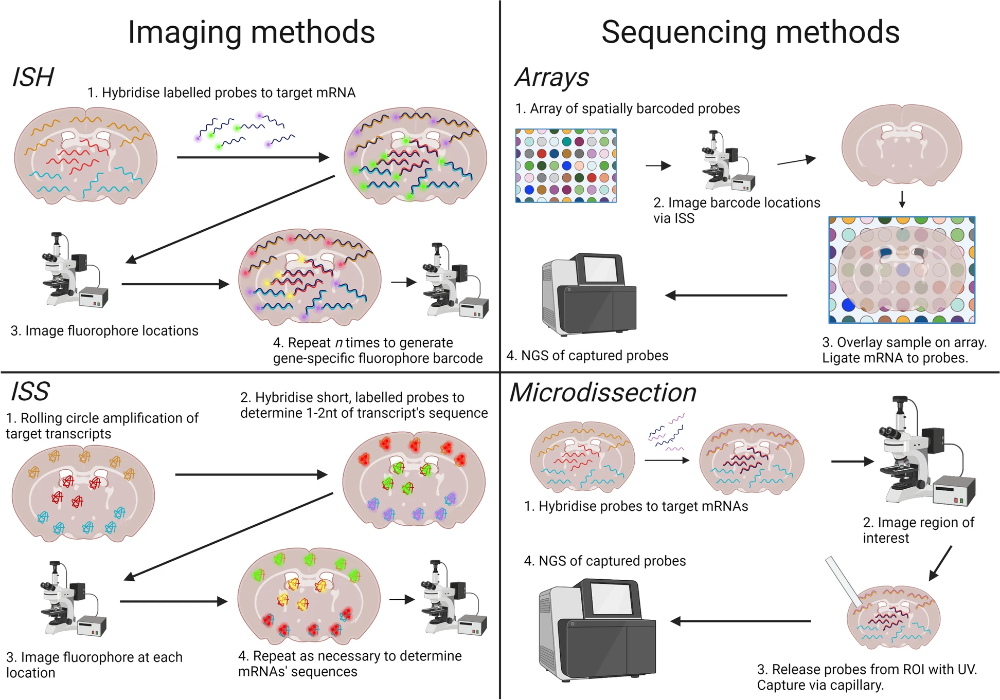
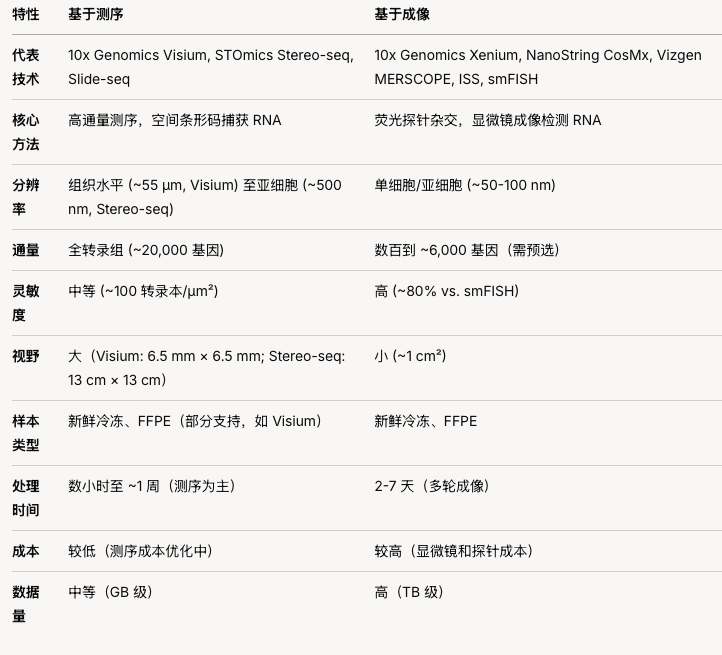

# 空间转录组学习笔记

空间组学（Spatial Omics）技术涵盖空间转录组学（Spatial Transcriptomics，ST）和空间蛋白质组学（Spatial Proteomics），通过在组织切片中保留空间信息，分析基因表达或蛋白质分布。

空间转录组学（如 10x Genomics Visium、Xenium、NanoString GeoMx、CosMx、Vizgen MERSCOPE、STOmics Stereo-seq）和 空间蛋白质组学（如 Akoya Biosciences PhenoCycler/CODEX、Canopy Biosciences ZellExplorer）

ST分类：

[Williams C G, Lee H J, Asatsuma T, et al. An introduction to spatial transcriptomics for biomedical research[J]. Genome medicine, 2022, 14(1): 68. ](https://link.springer.com/article/10.1186/s13073-022-01075-1)

**Imaging-based spatially resolved transcriptomics**

        in situ hybridization (ISH)
        in situ sequencing (ISS)
商业化平台：10x Genomics Xenium、NanoString CosMx SMI、Vizgen MERSCOPE 

**Sequencing-based methods**

商业化平台：10x Genomics Visium、NanoString GeoMx DSP、STOmics Stereo-seq

**比较表：基于测序 vs. 基于成像的空间转录组技术**

