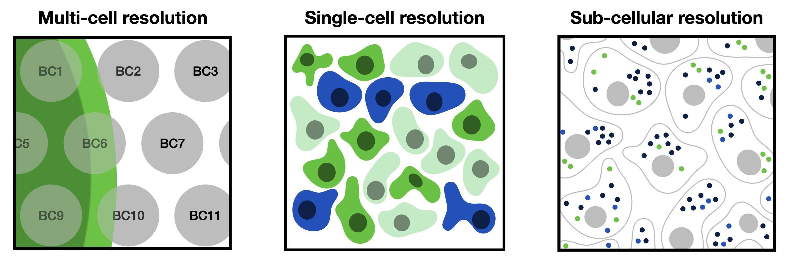
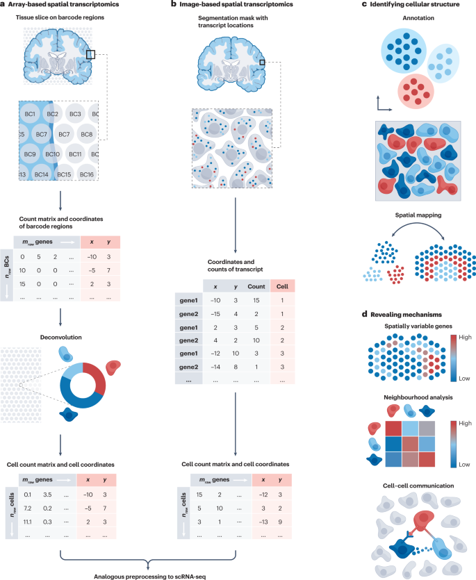
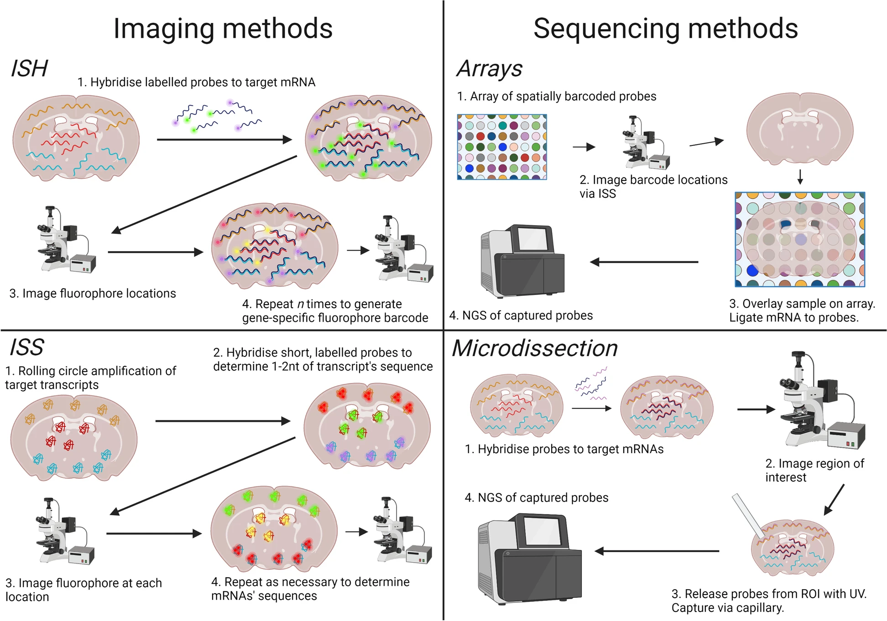
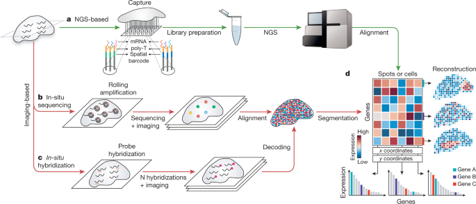
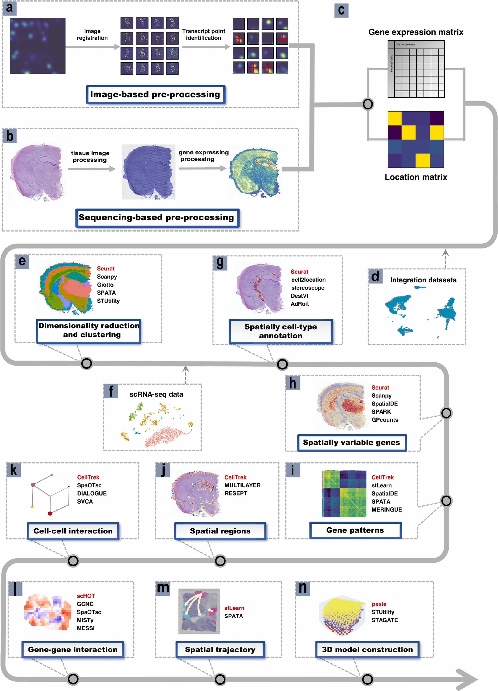

# 空间转录组学习笔记

*Spatial omics:* https://www.sc-best-practices.org/spatial/introduction.html

## 0.Overview of commonly used ST platforms

<small>

| Platform (type) | Resolution and panel type | Sample types | RNA quality | Best use cases |
|:---|:---|:---|:---|:---|
| **Visium (FF, sequencing)** | ~55 µm; whole transcriptome | Human, mouse, all species (polyA⁺) | RIN ≥ 7 (≥4 w/ CytAssist) | Broad discovery in fresh tissue |
| **Visium (FFPE, sequencing)** | ~55 µm; whole transcriptome | Human, mouse FFPE | DV200 ≥ 50% (≥30% w/ CytAssist) | Archived samples; full profiling |
| **Visium HD (sequencing)** | ~2 µm; whole transcriptome | Human, mouse FFPE or OCT | RIN ≥ 4; DV200 ≥ 30% | High-res + whole transcriptome |
| **Illumina StrataMap Spatial (sequencing)** ★ | ~1 µm features; cellular resolution; whole transcriptome (polyA⁺, coding + long ncRNA) | Eukaryotic species; **FF (OCT) only** (FFPE in development, ~2027) | FF optimized; vendor has not published a fixed RIN/DV200 cutoff | Unbiased whole-transcriptome at cellular resolution; large capture area (up to 50 × 15 mm); multi-section / cohort-scale profiling within Illumina NGS + DRAGEN/ICM workflow |
| **Xenium (imaging)** | Subcellular; targeted (up to 5000 genes; customizable) | Human, mouse FFPE or fresh-frozen; non-model (custom) | DV200 ≥ 10% | Cell typing; high-res profiling; cross-species (custom panels) |
| **CosMx (imaging)** | Subcellular; targeted panels (up to 6K) or whole-transcriptome (~18K genes, WTX) | Human, mouse FFPE or fresh-frozen | DV200 ≥ 10% | Multiplexed profiling; spatial cell state mapping |
| **MERFISH / seqFISH (imaging)** | Subcellular; highly multiplexed (customizable) | Fresh-frozen; FFPE (with optimization) | Protocol-dependent | Deep profiling in microscopy-capable labs |
| **Stereo-seq (sequencing)** | 500 nm; whole transcriptome (species-specific probes) | Human, mouse, non-model (custom probes) | RIN ≥ 7 recommended | Nanoscale mapping; large area profiling |
| **Non-model species** | Varies by platform and probe design | Visium (polyA⁺), Xenium, Stereo-seq, **StrataMap (polyA⁺, any eukaryote)** | Variable | Cross-species studies (requires custom panels or transcriptomes) |

</small>

[Grases D, Porta-Pardo E. A practical guide to spatial transcriptomics: lessons from over 1000 samples[J]. Trends in biotechnology, 2025.](https://www.cell.com/trends/biotechnology/abstract/S0167-7799(25)00357-9)

[Heumos L, Schaar A C, Lance C, et al. Best practices for single-cell analysis across modalities[J]. Nature Reviews Genetics, 2023, 24(8): 550-572.](https://www.nature.com/articles/s41576-023-00586-w)

[Williams C G, Lee H J, Asatsuma T, et al. An introduction to spatial transcriptomics for biomedical research[J]. Genome medicine, 2022, 14(1): 68.](https://link.springer.com/article/10.1186/s13073-022-01075-1)

[Rao A, Barkley D, França G S, et al. Exploring tissue architecture using spatial transcriptomics[J]. Nature, 2021, 596(7871): 211-220.](https://www.nature.com/articles/s41586-021-03634-9)

[Yue L, Liu F, Hu J, et al. A guidebook of spatial transcriptomic technologies, data resources and analysis approaches[J]. Computational and Structural Biotechnology Journal, 2023, 21: 940-955.](https://www.sciencedirect.com/science/article/pii/S2001037023000156)

---

## 1.raw_data

<small>

| 比较维度 | Spot (物理捕获位点/斑点) | Bin (数字分箱/网格) |
| :--- | :--- | :--- |
| **硬件本质** | 芯片表面预先用微纳加工刻蚀好的、**离散的圆形捕获岛屿**。 | 芯片表面物理上**绝对连续、无缝铺满**的纳米/微米级高密度像素点。 |
| **空间连续性** | **不连续（有盲区）。** 点与点之间存在大量组织无法被测到的物理空隙（留白死区）。 | **绝对连续。** 像数码相机的相机像素一样，全景无缝覆盖整张组织切片。 |
| **尺寸可调性** | **物理固定。** 出厂硬件决定（如经典 Visium 的直径 $55\text{ }\mu\text{m}$，中心距 $100\text{ }\mu\text{m}$）。 | **算法可调。** 生信分析时可自由设置（如 `Bin20` $\approx 10\text{ }\mu\text{m}$，`Bin50` $\approx 25\text{ }\mu\text{m}$）。 |
| **分辨率层级** | **多细胞级**（根据组织密度，单个 Spot 盖住 $1 \sim 10+$ 个细胞）。 | **虚拟单细胞级 $\rightarrow$ 组织级**（可通过调整分箱大小自由横向切换）。 |
| **核心生信任务** | **细胞型解卷积（Deconvolution）**。 （利用单细胞参考集拆解每个 Spot 内的混合细胞比例） | **细胞分割（Cell Segmentation）**。 （结合 H&E 图像算法将连续的 Bin 打包成真实的单细胞） |
| **典型代表平台** | 10x Genomics Visium（经典版）、传统 Spatial Transcriptomics。 | 华大 Stereo-seq、10x Visium HD、Illumina StrataMap™。 |
| **下机原始文件** | `matrix.mtx.gz`、`spatial/tissue_positions.csv`（按 Spot ID 排列）。 | 巨大的坐标文件（如华大 `*.gef`、`*.tsv` 或存储分子坐标的 `*.parquet`）。 |
| **单样本数据量** | **小。** 一张芯片几千个 Spot，普通笔记本电脑即可轻松跑完完整管线。 | **极大。** 动辄数百万个分箱，极其消耗服务器内存（RAM）与计算显存。 |
| **样本包容度** | **高。** 容错率相对较好，对中等降解的样本适应力较强。 | **严苛。** 对切片平整度、RNA 完整度要求极高，极易产生边缘晕染（Smearing）噪声。 |

| 分箱名称 | 包含物理点矩阵 | 实际物理边长 ($\mu\text{m}$) | 生信层面的等价生物学概念 |
| :--- | :--- | :--- | :--- |
| **Bin 1** | $1 \times 1$ | $0.5\text{ }\mu\text{m}$ ($500\text{ nm}$) | **极微观亚细胞级**（只能看单分子坐标） |
| **Bin 20** | $20 \times 20$ | **$10\text{ }\mu\text{m}$** | **单细胞级**（刚巧能装下一个标准淋巴/上皮细胞） |
| **Bin 50** | $50 \times 50$ | **$25\text{ }\mu\text{m}$** | **多细胞级**（约覆盖 $2 \sim 4$ 个细胞，信号更丰富） |
| **Bin 100** | $100 \times 100$ | **$50\text{ }\mu\text{m}$** | **组织结构域级**（接近经典版 10x Visium 的 $55\text{ }\mu\text{m}$ Spot） |

</small>

* The starting sequencing depth recommendation is 5,000 raw reads per 10x10 um tissue. 
* StrataMap Spatial detected up to 4000 unique transcripts per 10 × 10 µm bin
* 1-12 tissue sections can be placed on each slide

---
## [2.QC](./2.QC/README.md)

---
## [3.spatial alignment](./3.spatial alignment/README.md)

| 维度 | 核心结论 |
|------|----------|
| 总体 | **没有万能冠军**，方法选择高度依赖平台与场景 |
| NGS 类 | PASTE2、SPACEL 精度领先 |
| 成像类 | Spateo 综合最优 |
| 鲁棒性 | PASTE2、SPACEL 最稳定 |
| 多切片 | Spateo 优势明显 |
| 跨平台 | 当前方法普遍不足，是重要发展方向 |
| 大数据 | 需预对齐 + 降采样 + 参数优化 |
| 下游 | 好对齐显著提升 3D 空间聚类精度 |
| 工具 | SABench 提供可复现的评测框架 |

[Yan Y, Gu T, Sun C, et al. Benchmarking alignment methods for spatial transcriptomics data[J]. Nature Computational Science, 2026: 1-18.](https://www.nature.com/articles/s43588-026-00977-z)

---