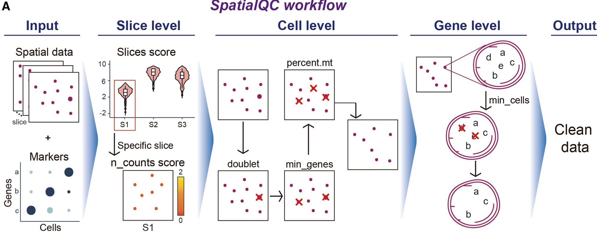
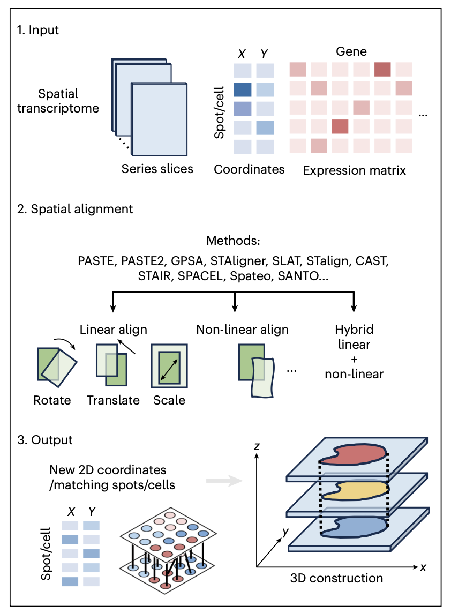
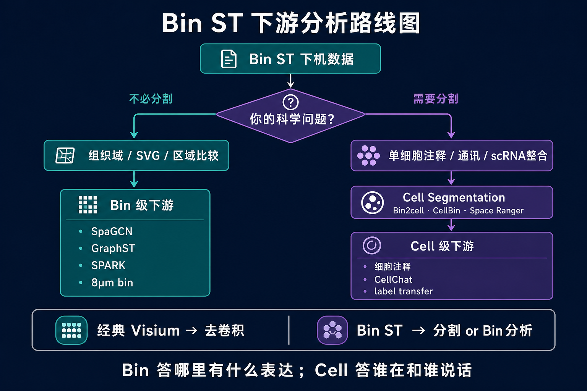
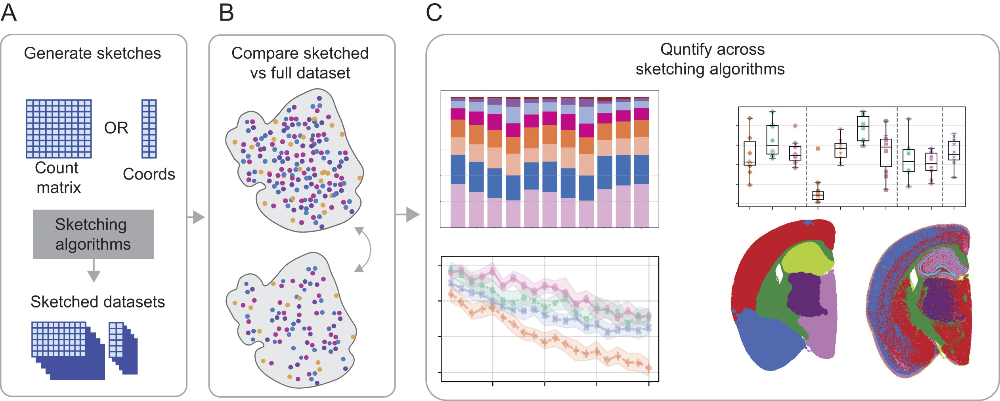
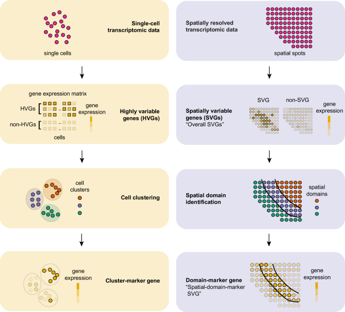
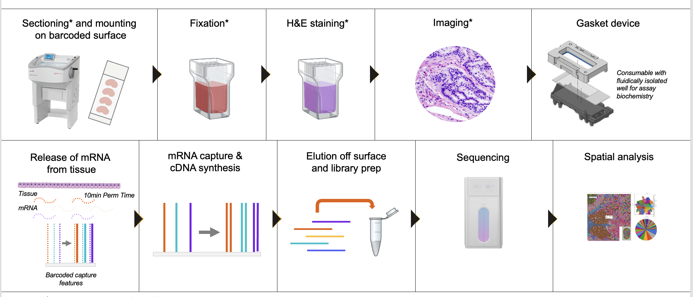

# 空间转录组学习笔记

Nature Methods 将 Spatially Resolved Transcriptomics（空间转录组学） 评选为 2020 年度技术（Method of the Year 2020）[Marx V. Method of the Year: spatially resolved transcriptomics[J]. Nature methods, 2021, 18(1): 9-14.](https://www.nature.com/articles/s41592-020-01033-y)

## Tutorials

**Spatial omics:** https://www.sc-best-practices.org/spatial/introduction.html

**awesome spatial omics:** https://github.com/crazyhottommy/awesome_spatial_omics

**Spatial Transcriptomics Tools:** https://github.com/p-gueguen/Spatial_transcriptomics_tools

**Orchestrating Spatial Transcriptomics Analysis with Bioconductor:** https://bioconductor.org/books/release/OSTA/

**Analysis, visualization, and integration of Visium HD spatial datasets with Seurat:** https://satijalab.org/seurat/articles/visiumhd_analysis_vignette

**Spatial transcriptomics data analysis: theory and practice:** https://bookdown.org/sjcockell/ismb-tutorial-2023/

**SIB Days tutorial: Analysis of spatial transcriptomics data:** https://sib-swiss.github.io/spatial-transcriptomics-training/

---
## [Reviews paper](./Reviews/)

[Grases D, Porta-Pardo E. A practical guide to spatial transcriptomics: lessons from over 1000 samples[J]. Trends in biotechnology, 2025.](https://www.cell.com/trends/biotechnology/abstract/S0167-7799(25)00357-9)

[Heumos L, Schaar A C, Lance C, et al. Best practices for single-cell analysis across modalities[J]. Nature Reviews Genetics, 2023, 24(8): 550-572.](https://www.nature.com/articles/s41576-023-00586-w)

[Williams C G, Lee H J, Asatsuma T, et al. An introduction to spatial transcriptomics for biomedical research[J]. Genome medicine, 2022, 14(1): 68.](https://link.springer.com/article/10.1186/s13073-022-01075-1)

[Rao A, Barkley D, França G S, et al. Exploring tissue architecture using spatial transcriptomics[J]. Nature, 2021, 596(7871): 211-220.](https://www.nature.com/articles/s41586-021-03634-9)

[Yue L, Liu F, Hu J, et al. A guidebook of spatial transcriptomic technologies, data resources and analysis approaches[J]. Computational and Structural Biotechnology Journal, 2023, 21: 940-955.](https://www.sciencedirect.com/science/article/pii/S2001037023000156)

---

## [0.platform](./0.platform/)

### 平台分类

| 分组 | 技术类型 | 平台 |
|------|----------|------|
| **G1** | 测序法 · 低分辨率 | 10x Visium、GeoMx DSP |
| **G2** | 测序法 · 高分辨率 | 10x Visium HD、Stereo-seq、**Illumina StrataMap Spatial** ★ |
| **G3** | 成像法 · 单细胞/亚细胞 | Vizgen MERSCOPE、10x Xenium、Bruker CosMx SMI |

>**G1：测序法 · 低分辨率（spot/ROI 级)** 
> 
>| 平台 | 分辨率 | 基因覆盖 | 适合场景 |
> |------|--------|----------|----------|
> | **10x Visium** | 55 μm spot（多细胞） | 全转录组 | 最快上手、无偏发现、FF/FFPE |
> | **GeoMx DSP** | >55 μm ROI（建议 ≥50 细胞） | ROI 内全转录组 + 570 蛋白 | 病理圈选区域、多活检并行 |
>
>**G2：测序法 · 高分辨率（单细胞尺度）**
> 
> | 平台 | 分辨率 | 基因覆盖 | 适合场景 |
> |------|--------|----------|----------|
> | **Visium HD** | 2 μm 连续网格（分析常用 8/16 μm bin） | 全转录组 | FFPE 成熟生态 + 近单细胞精度 |
> | **Stereo-seq** | 0.22 μm DNB 特征 | 全转录组 | 任意物种、超大捕获面积（cm 级） |
> | **Illumina StrataMap** ★ | 1 μm 连续特征 + 细胞分割 | 全转录组（polyA⁺） | 大捕获面积（最大 50×15 mm）、Illumina 测序栈 |
>
> G3：成像法 · 单细胞/亚细胞**
>
>| 平台 | 分辨率 | 基因覆盖 | 适合场景 |
>|------|--------|----------|----------|
>| **10x Xenium** | ~200 nm | Prime 5K ~5000 基因；定制 ~480 基因 | FFPE 稳健、同片 RNA+蛋白（2025–2026） |
>| **CosMx SMI** | 亚细胞 | 6K panel 或 WTX ~18K 蛋白编码基因 | 高多重靶向 / 准全转录组成像 |
>| **MERSCOPE** | 单细胞/亚细胞 | 预制 ~5000 或全定制 ≤1000 基因 | 开放定制任意物种、支持类器官 |

### 平台选择

|你的需求 | 优先考虑 |
|----------|----------|
| 无偏全转录组 + 最快上手 | **10x Visium**（G1） |
| 无偏全转录组 + 已知 ROI / 多活检并行 | **GeoMx**（G1） |
| 无偏全转录组 + 单细胞尺度 + FFPE 生态成熟 | **Visium HD**（G2） |
| 无偏全转录组 + 任意物种 + 超大组织 | **Stereo-seq**（G2） |
| 无偏全转录组 + **1 µm 分辨率 + 大捕获面积 + Illumina 测序栈** | **StrataMap Spatial**（G2）★ |
| 靶向 panel + 亚细胞精度 + FFPE 稳健 | **Xenium**（G3） |
| 靶向 panel + 开放定制任意物种 | **MERSCOPE**（G3） |
| 靶向高多重（6K）或准全转录组成像（WTX ~18K） | **CosMx**（G3） |

>样本类型决策补充:
>
>| 样本类型 | 推荐平台 |
>|----------|----------|
>| **FFPE 归档样本** | Visium v2/CytAssist、Visium HD、Xenium、CosMx |
>| **新鲜冷冻 FF** | Visium、Stereo-seq、StrataMap（当前仅 FF） |
>| **非模式物种** | Visium（polyA⁺）、Stereo-seq（定制探针）、MERSCOPE（≤1000 基因无设计费）、StrataMap（polyA⁺ 真核通用） |

**注释**  
- *FF*：Fresh Frozen（新鲜冷冻）；*FFPE*：福尔马林固定石蜡包埋；*FxF*：Fixed Frozen（固定冷冻）

[You Y, Fu Y, Li L, et al. Systematic comparison of sequencing-based spatial transcriptomic methods[J]. Nature methods, 2024, 21(9): 1743-1754.](https://www.nature.com/articles/s41592-024-02325-3)

[Lim H J, Wang Y, Buzdin A, et al. A practical guide for choosing an optimal spatial transcriptomics technology from seven major commercially available options[J]. BMC genomics, 2025, 26(1): 47.](https://link.springer.com/article/10.1186/s12864-025-11235-3)

[Cervilla S, Grases D, Perez E, et al. A technical comparison of spatial transcriptomics platforms across six cancer types[J]. Genome Biology, 2026.](https://link.springer.com/article/10.1186/s13059-026-03937-y)

---

## [1.raw_data](./1.raw_data/README.md)

### L0：湿实验端原始数据
>**共通文件**
>
>| 类型 | 内容 | 用途 |
>|------|------|------|
>| **FASTQ** | Read1（spatial barcode）+ Read2（cDNA） | 送入官方流程 |
>| **参考基因组** | 物种 GTF + FASTA | 比对注释 |
>| **样本信息** | 物种、组织、切片厚度 | 流程配置 |
>
>**图像：组织图 vs 芯片图（两种不同用途的图）**
>
>| | **组织图（H&E）** | **芯片图（HD slide / CytAssist）** |
>|---|---|---|
>| 看什么 | 细胞形态、病理结构 | 组织在 **捕获芯片** 上的位置 |
>| 用途 | 分割、注释、QC | **barcode → 坐标**（生信必需） |
>| 坐标系 | 病理扫描仪 | **芯片坐标系** |
>
>**H&E 图像在空间转录组中的作用*
>
>H&E（hematoxylin and eosin，苏木精-伊红）苏木精将细胞核染成深蓝色/紫色，伊红将细胞质染成粉红色，从而让原本透明的组织切片在显微镜下显现出清晰的解剖学和病理学结构,染色图像是空间转录组实验中重要的形态学信息来源。空间转录组技术同时获得**基因表达信息（molecular information）**和**组织空间结构信息（spatial information）**，而 H&E 图像能够提供额外的**组织形态学信息（histological information）**，帮助解析基因表达与组织结构之间的关系。 在不同空间转录组分析任务中，H&E 图像的作用有所不同：
>
>| 分析用途 | 是否需要 H&E 预处理 | 主要作用 |
>| --- | --- | --- |
>| Spot/bin 表达可视化 | 少量处理 | 将空间表达结果映射到组织区域 |
>| 空间域识别（spatial domain identification） | 通常不需要或简单处理 | 提供组织形态辅助信息，提高空间区域划分准确性 |
>| 组织区域识别（tissue detection） | 需要 | 去除背景区域，确定有效组织范围 |
>| 细胞分割（cell segmentation） | 必须 | 根据组织形态识别细胞或细胞核边界 |
>| 图像特征提取（image feature extraction） | 必须 | 提取纹理、形态、颜色等特征用于多模态分析 |
>| 深度学习模型 | 必须 | 将 H&E 图像转换为图像特征，与基因表达联合建模 |

>**H&E image 常见文件格式**
>
>| 文件格式 | 全称 | 是否常用于空间转录组 | 特点 |
>| --- | --- | --- | --- |
>| `.tif / .tiff` | Tagged Image File Format | ⭐⭐⭐⭐⭐ 最常见 | 支持超大图像、多层分辨率、无损压缩，空间转录组分析中最常用 |
>| `.ome.tiff` | Open Microscopy Environment TIFF | ⭐⭐⭐⭐⭐ 推荐 | 支持图像数据和实验元信息，适合大规模空间组学分析 |
>| `.svs` | Aperio Whole Slide Image | ⭐⭐⭐⭐ | 病理扫描仪常用格式，包含多分辨率图像 |
>| `.ndpi` | Hamamatsu NanoZoomer Digital Pathology Image | ⭐⭐⭐⭐ | Hamamatsu扫描仪生成的病理图像格式 |
>| `.scn` | Leica SCN | ⭐⭐⭐ | Leica数字病理扫描格式 |
>| `.mrxs` | MIRAX Slide Format | ⭐⭐⭐ | 3DHISTECH扫描系统常用格式 |
>| `.czi` | Zeiss CZI | ⭐⭐ | Zeiss显微镜图像格式 |
>| `.png` | Portable Network Graphics | ⭐ | 常用于可视化和小规模分析 |
>| `.jpg/jpeg` | Joint Photographic Experts Group | ⭐ | 压缩格式，一般不推荐用于定量分析 |

### L1 流程输出

>**Visium HD 两条路径：**
>
    ```
    FF 直接上片：
      → 芯片上明场/H&E 图（1 张，定坐标）
      → 可选额外高分辨 H&E（形态分析）
    
    FFPE + CytAssist：
      → H&E 组织图 ①（形态）
      → CytAssist/芯片对齐图 ②（定坐标）
      → 两张图，软件配准后送 Space Ranger
    ```
> **组织图 = 看形态；芯片图 = 定位置。**
> 
>**Visium HD（Space Ranger)`sample/outs/` 核心结构**
> 
        outs/
        ├── web_summary.html
        ├── metrics_summary.csv
        ├── barcode_mappings.parquet      # barcode ↔ bin ↔ cell 映射
        │
        ├── binned_outputs/               # ★ Bin 分析主入口
        │   ├── square_002um/             # 2 μm（最细，极稀疏）
        │   ├── square_008um/             # 8 μm（★ 官方推荐）
        │   └── square_016um/             # 16 μm（更平滑）
        │       每个 bin 目录下：
        │       ├── raw_feature_bc_matrix/
        │       │   ├── barcodes.tsv.gz   # ★ 此处 barcode = bin ID
        │       │   ├── features.tsv.gz
        │       │   └── matrix.mtx.gz
        │       ├── raw_feature_bc_matrix.h5
        │       ├── filtered_feature_bc_matrix/
        │       ├── filtered_feature_bc_matrix.h5
        │       └── spatial/
        │           ├── tissue_positions.parquet
        │           ├── scalefactors_json.json
        │           ├── tissue_hires_image.png
        │           └── tissue_lowres_image.png
        │
        └── segmented_outputs/            # 细胞分割（可选）
            ├── cell_segmentations.geojson
            ├── filtered_feature_cell_matrix.h5
            └── spatial/
>
> **Stereo-seq（SAW）**
>
>| 文件 | 说明 |
>|------|------|
>| `.raw.gef` | 原始分子坐标 + count |
>| `.tissue.gef` | 组织范围内 bin 矩阵 |
>| `.cellbin.gef` | 细胞分割后 cell-bin 矩阵 |
>| `.gem` | 文本：`geneID, x, y, MIDCount, ExonCount` |
>| `.ipr` / 图像包 | StereoMap 配套图像 |

---
### 2.Bin_vs_Spot

SpaceRanger outputs Visium HD data at three bin sizes, offering **8 µm** and **16 µm** bin sizes in addition to the native 2 µm feature size.A custom bin size (in microns at even integer values between 10 and 100) can be defined in Space Ranger or via third-party tools.
the 8 µm bin size is an effective starting point for most researchers.

**Analysis, visualization, and integration of Visium HD spatial datasets with Seurat:** https://satijalab.org/seurat/articles/visiumhd_analysis_vignette)

**Visium HD (segmented):** https://bioconductor.org/books/release/OSTA/pages/seq-workflow-visium-hd-seg.html

| 比较维度 | Spot（物理捕获位点） | Bin（数字分箱/网格） |
|----------|----------------------|----------------------|
| 定义 | 芯片上固定的物理捕获区域 | 测序后按坐标划分的虚拟网格 |
| 典型平台 | Visium v1/v2（55 μm spot） | Visium HD、StrataMap（2 μm / 1 μm 特征 → 8–16 μm bin 分析） |
| 数据特点 | 多细胞混合，需去卷积 | 更细粒度，可细胞分割 |
| 分析策略 | SPOTlight / Cell2location | 直接注释或 Bin2cell |

| 平台 | 推荐流程 |
|------|----------|
| Visium HD | Space Ranger `segmented_outputs/`，或 2 μm bin + **Bin2cell** |
| Stereo-seq | SAW → **CellBin**（利用芯片 track line 做亚像素配准） |
| StrataMap | DRAGEN + ICM（宣称整合 1 μm 特征与分割） |

| 分箱名称 | 包含物理点矩阵 | 实际物理边长 ($\mu\text{m}$) | 生信层面的等价生物学概念 |
| :--- | :--- | :--- | :--- |
| **Bin 1** | $1 \times 1$ | $0.5\text{ }\mu\text{m}$ ($500\text{ nm}$) | **极微观亚细胞级**（只能看单分子坐标） |
| **Bin 20** | $20 \times 20$ | **$10\text{ }\mu\text{m}$** | **单细胞级**（刚巧能装下一个标准淋巴/上皮细胞） |
| **Bin 50** | $50 \times 50$ | **$25\text{ }\mu\text{m}$** | **多细胞级**（约覆盖 $2 \sim 4$ 个细胞，信号更丰富） |
| **Bin 100** | $100 \times 100$ | **$50\text{ }\mu\text{m}$** | **组织结构域级**（接近经典版 10x Visium 的 $55\text{ }\mu\text{m}$ Spot） |

* The starting sequencing depth recommendation is 5,000 raw reads per 10x10 um tissue. 
* StrataMap Spatial detected up to 4000 unique transcripts per 10 × 10 µm bin
* 1-12 tissue sections can be placed on each slide
---

## [3.QC](./3.QC/README.md)



[Mao G, Yang Y, Luo Z, et al. SpatialQC: automated quality control for spatial transcriptome data[J]. Bioinformatics, 2024, 40(8): btae458.](https://academic.oup.com/bioinformatics/article/40/8/btae458/7720780?login=false)

---

## [3.alignment](./3.alignment/README.md)



| 维度 | 核心结论 |
|------|----------|
| 总体 | **没有万能冠军**，方法选择高度依赖平台与场景 |
| NGS 类 | PASTE2、SPACEL 精度领先 |
| 成像类 | Spateo 综合最优 |
| 鲁棒性 | PASTE2、SPACEL 最稳定 |
| 多切片 | Spateo 优势明显 |
| 跨平台 | 当前方法普遍不足，是重要发展方向 |
| 大数据 | 需预对齐 + 降采样 + 参数优化 |
| 下游 | 好对齐显著提升 3D 空间聚类精度 |
| 工具 | SABench 提供可复现的评测框架 |

[Yan Y, Gu T, Sun C, et al. Benchmarking alignment methods for spatial transcriptomics data[J]. Nature Computational Science, 2026: 1-18.](https://www.nature.com/articles/s43588-026-00977-z)

[Khan M, Arslanturk S, Draghici S. A comprehensive review of spatial transcriptomics data alignment and integration[J]. Nucleic acids research, 2025, 53(12): gkaf536.](https://academic.oup.com/nar/article/53/12/gkaf536/8174767?login=false)

---

## [4.pipeline](4.pipeline/README.md)



spatialGE:https://github.com/FridleyLab/spatialGE


### 4-2:[sketch](./sketch/)



Visium HD 一张片 8 μm bin 动辄 30 万～40 万 列；Stereo-seq、MERFISH atlas 更是百万级。全量跑 PCA、建图、Louvain、去卷积——笔记本扛不住，服务器也慢。

于是 Sketch（智能子抽样） 成了大样本空间转录组的标配：先抽一小撮「有代表性」的 spot/bin，在子集上算聚类或注释，再投影回全量。

| 平台 / 数据 | 量级（约） |
|-------------|------------|
| 经典 Visium | ~5,000 spot/片 |
| Visium HD（8 μm） | **30 万～40 万 bin/片** |
| Stereo-seq、大 MERFISH atlas | **10 万～百万+** 细胞/位点 |

Seurat Visium HD 教程里，小鼠脑 8 μm 数据约 **39 万 bin**；在 5 万 sketch 上跑 Louvain 约 **27 秒**，全量 BANKSY 聚类同类操作约 **201 秒**——这还是「能放进内存」的情况。

单细胞领域早有成熟方案：**Leverage score**（Seurat v5）、**Geosketch**（Hie et al., 2019）、**scSampler**（maximin 多样性）等——目标都是在**表达空间**里均匀覆盖异质性。

关键发现：scRNA 的 Sketch 用在 ST 上会「抽歪」

① 只用表达（PCA / Leverage / Geosketch）

- **优点**：抓住全局转录异质性，稀有转录状态不易漏  
- **缺点**：**过度抽样高变异区域**（肿瘤边缘、层状边界、免疫浸润带），**欠抽样同质区域**（大片均匀皮质、基质）  
- **后果**：组织架构在 sketch 里变形——空间图看起来「该平的地方不平」

② 只用坐标（uniform on xy）

- **优点**：组织覆盖均匀，不遗漏物理区域  
- **缺点**：**漏掉转录极端态**——稀有细胞类型、高表达 outlier 可能被忽略  
- **后果**：聚类稳定，但生物学上「该有的稀有群没了」

③ 论文推荐：**Spatially smoothed leverage scores**

[Gingerich I K, Goods B A, Frost H R. Benchmarking sketching methods on spatial transcriptomics data[J]. Nucleic Acids Research, 2026, 54(9): gkag434.](https://academic.oup.com/nar/article-pdf/doi/10.1093/nar/gkag434/68264987/gkag434.pdf)

### [SVG（Spatially Variable Genes，空间可变基因）](./SVG/)

**Spatially variable genes:** https://www.sc-best-practices.org/spatial/spatially_variable_genes.html

| | **HVG（单细胞）** | **SVG（空间转录组）** |
|---|---|---|
| **问的问题** | 哪些基因在细胞间差异大？ | 哪些基因在**空间上**有非随机分布？ |
| **利用的信息** | 表达矩阵 | 表达矩阵 + **坐标** |
| **典型用途** | 降维、聚类、批次校正 | 特征筛选、空间域发现、机制解读 |
| **可能遗漏** | 有空间梯度但细胞间差异不大的基因 | 细胞类型 marker，但本身无显著空间模式 |



#### SVG 分为 **三类**：

##### 1. Overall SVGs（整体空间可变基因）

- **定义**：在整个组织层面，基因表达呈现非随机的空间模式
- **用途**：为下游分析（空间域识别、功能模块）筛选**信息量大**的特征基因
- **类比单细胞**：最接近「全局 HVG」，但加了空间约束

##### 2. Cell-type-specific SVGs（细胞类型特异性 SVG）

- **定义**：在**某一种细胞类型内部**，基因表达仍随空间位置变化
- **用途**：发现同一细胞类型的**空间亚状态**（如肿瘤边缘 vs 核心的巨噬细胞）
- **需要**：已知或推断的细胞类型信息

##### 3. Spatial-domain-marker SVGs（空间域 marker 基因）

- **定义**：在**已划定的空间域内**高表达的基因
- **用途**：解释某个空间区域的分子特征
- **需要**：先做空间域划分，再找 marker

#### 数据分辨率很重要

综合表现较好的包括：**BinSpect、SPARK、SpatialDE、SPARK-X、dCor** 等，但具体排名因评价标准和数据集而异。

| 分辨率 | 特点 | 方法选择提示 |
|--------|------|--------------|
| **低分辨率**（如 Visium >50 μm） | 空间模式较平滑 | 空间感知聚类（如 BayesSpace）+ SVG 组合效果更好 |
| **高分辨率**（<20 μm，如 Slide-seq、Stereo-seq） | 更稀疏、更精细 | BinSpect 较稳健；Moran's I 类方法（MERINGUE）在高分辨率稀疏数据上可能偏弱 |
| **中分辨率** | 介于两者之间 | SOMDE 等合并邻近位点的方法可能更有优势 |

- 若目标是 **空间域聚类**：低分辨率数据优先考虑 SVG + **BayesSpace**
- 若目标是 **高分辨率精细分域**：SVG + 传统 scRNA-seq 聚类（Louvain/Leiden）有时反而更好

| 你的场景 | 更倾向参考 |
|----------|------------|
| Visium / 10x 入门，要快速筛 + 稳健 | **SPARK-X**（两篇文均表现突出；2024 文强调速度与稀疏稳健性） |
| Squidpy / Scanpy 生态，先跑通流程 | **Moran's I**（快、教程多；但 **p 值需谨慎**，建议配合可视化） |
| 需要统计框架完整、模拟数据 FDR 较准 | **SpatialDE、SOMDE、nnSVG** |
| 数据很稀疏、spot 数波动大 | 优先 **SPARK-X / SpatialDE / SOMDE**；慎用对下采样敏感的 Giotto / MERINGUE |
| 做空间域聚类 | top SVG 取 **~1000 个** 左右试探（Chen C 2024）；低分辨率可叠加 **BayesSpace**（Chen X 2025） |

[Chen C, Kim H J, Yang P. Evaluating spatially variable gene detection methods for spatial transcriptomics data[J]. Genome Biology, 2024, 25(1): 18.](https://link.springer.com/article/10.1186/s13059-023-03145-y)

[Adhikari S D, Yang J, Wang J, et al. Recent advances in spatially variable gene detection in spatial transcriptomics[J]. Computational and Structural Biotechnology Journal, 2024, 23: 883-891.](https://www.sciencedirect.com/science/article/pii/S2001037024000163)

[Chen X, Ran Q, Tang J, et al. Benchmarking algorithms for spatially variable gene identification in spatial transcriptomics[J]. Bioinformatics, 2025, 41(4): btaf131.](https://academic.oup.com/bioinformatics/article/41/4/btaf131/8096371?login=false)

[Yan G, Hua S H, Li J J. Categorization of 34 computational methods to detect spatially variable genes from spatially resolved transcriptomics data[J]. Nature Communications, 2025, 16(1): 1141.](https://www.nature.com/articles/s41467-025-56080-w)

---

## illumina



---
